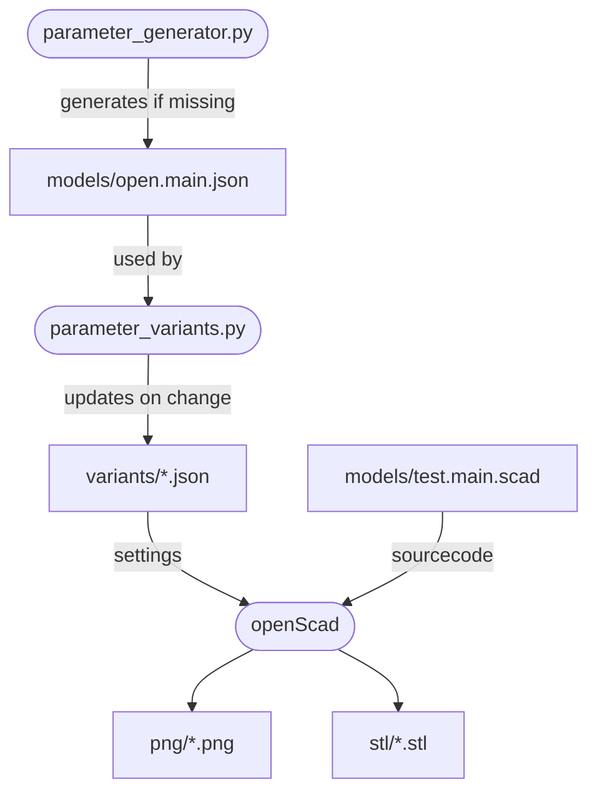

# openscad-multivariants-python-makefile

This is a build system that uses python to automatically generates a list of
different variations. This is suitable for openscad users who is creating a
singular scad projects with lots of variations or parts.

* `make all` - Make all png previews and stl files
* `make clear` - Clear all build files

Tip:
* `make -j8 all` - Same as `make all` but runs up to 8 jobs at the same time, leading to faster compilation. This is called Parallel Execution as explained in [gnu make manual](https://www.gnu.org/software/make/manual/make.html#Parallel).

This is a community supported build system so feel free to suggest change or
put in a pull request for consideration.

## Minimum support

This is intented to be used by windows users and linux users.

You need at least minimum:
* OpenSCAD installed
* makefile support
* Python 3.6 or higher

## Features

* changes to `models/*.json` does not always kick off all the stl builds if there is no changes to source code or the variation in file.

## How does this build system works

## Adapting to your project
* Run `make clean` to clean out any existing generated stls
* Change `parameter_generator.py` to match your needs then delete `models/*.json` file
* Adapt `models/*.scad` to include your code
* Run `make all` to autogenerate the missing parameter setting list `models/*.json` and kick off the variations